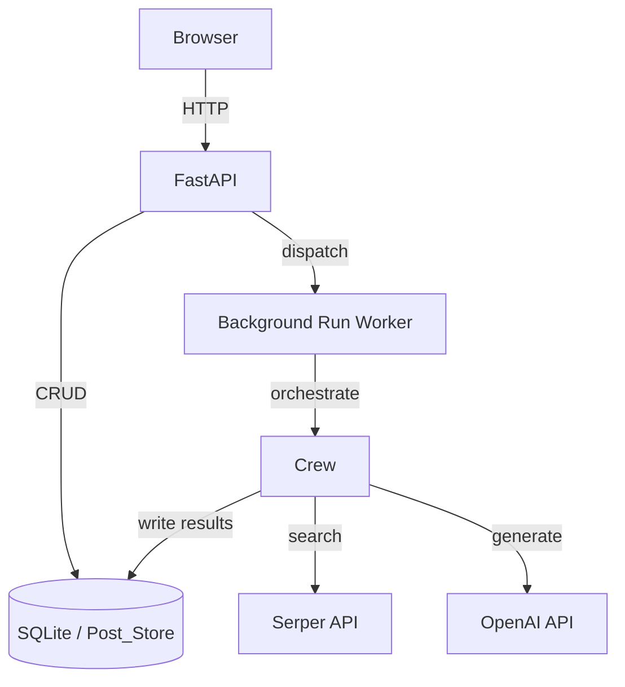
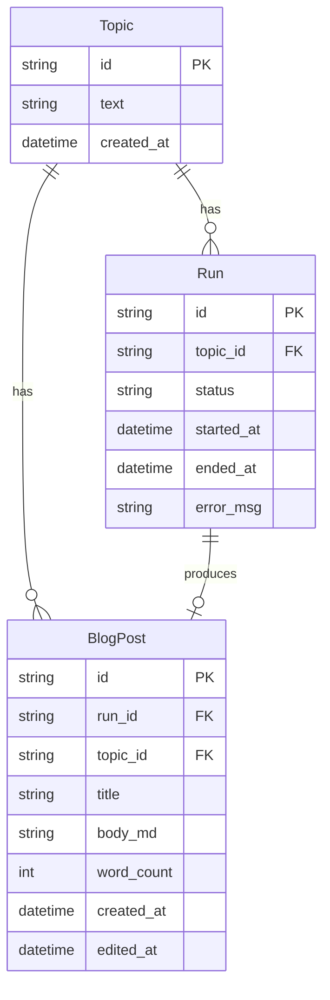

# Design Document: AI News Researcher and Blog Writer

## Overview

This system is a Python application that automates news research and blog post generation using a CrewAI multi-agent pipeline, exposed through a FastAPI + Jinja2 web dashboard. Users submit topics via the browser, the system dispatches a two-agent Crew (Research_Agent → Writer_Agent), and the resulting Markdown blog post is stored and rendered in the dashboard.

The key design goals are:
- Clean separation between the web layer (FastAPI), the agent layer (CrewAI), and the persistence layer (SQLite via SQLAlchemy)
- Async-friendly run execution so the dashboard remains responsive during long-running Crew jobs
- All secrets managed via environment variables, never hardcoded

---

## Architecture



The application runs as a single Python process. Background runs are executed in a `ThreadPoolExecutor` (or `asyncio` task) so the FastAPI event loop is not blocked. The dashboard polls a `/api/runs/{id}/status` endpoint every ≤5 seconds to reflect live run state.

### Technology Stack

| Layer | Technology |
|---|---|
| Web framework | FastAPI + Uvicorn |
| Templating | Jinja2 |
| Agent orchestration | CrewAI |
| Web search | Serper API (via `crewai-tools` SerperDevTool) |
| LLM | OpenAI GPT-4o (configurable) |
| Database | SQLite via SQLAlchemy (sync) |
| Migrations | Alembic |
| Config / secrets | python-dotenv + environment variables |
| Markdown rendering | `markdown` library (server-side) or `marked.js` (client-side) |

---

## Components and Interfaces

### 1. Configuration (`config.py`)

Reads all required environment variables at import time and raises a descriptive `EnvironmentError` (causing a non-zero exit) if any are missing.

```python
class Settings:
    SERPER_API_KEY: str
    OPENAI_API_KEY: str
    DATABASE_URL: str  # defaults to "sqlite:///./posts.db"
    OPENAI_MODEL: str  # defaults to "gpt-4o"
```

### 2. Database Models (`models.py`)

Three SQLAlchemy ORM models:

```
Topic
  id          UUID / str PK
  text        str (1–200 chars)
  created_at  datetime

Run
  id          UUID / str PK
  topic_id    FK → Topic.id (CASCADE DELETE)
  status      enum: pending | running | completed | failed
  started_at  datetime
  ended_at    datetime | null
  error_msg   str | null

BlogPost
  id          UUID / str PK
  run_id      FK → Run.id (CASCADE DELETE)
  topic_id    FK → Topic.id (CASCADE DELETE)
  title       str
  body_md     str (Markdown)
  word_count  int
  created_at  datetime
  edited_at   datetime | null
```

### 3. Post Store (`store.py`)

A thin repository layer wrapping SQLAlchemy sessions. Exposes:

```python
def create_topic(text: str) -> Topic
def list_topics() -> list[Topic]          # ordered by created_at DESC
def delete_topic(topic_id: str) -> None   # cascades to Runs + BlogPosts

def create_run(topic_id: str) -> Run
def update_run_status(run_id, status, error_msg=None, ended_at=None) -> Run
def list_runs() -> list[Run]              # ordered by started_at DESC
def get_run(run_id: str) -> Run

def save_blog_post(run_id, topic_id, title, body_md) -> BlogPost
def list_blog_posts() -> list[BlogPost]   # ordered by created_at DESC
def get_blog_post(post_id: str) -> BlogPost
def update_blog_post(post_id, body_md) -> BlogPost
```

### 4. CrewAI Agents (`crew.py`)

```python
research_agent = Agent(
    role="News Researcher",
    goal="Find at least 5 recent, relevant news items for the given topic",
    tools=[SerperDevTool()],
    llm=ChatOpenAI(model=settings.OPENAI_MODEL),
)

writer_agent = Agent(
    role="Blog Writer",
    goal="Write a well-structured Markdown blog post from the research",
    llm=ChatOpenAI(model=settings.OPENAI_MODEL),
)

def build_crew(topic: str) -> Crew:
    research_task = Task(
        description=f"Research the topic: {topic}. Retrieve at least 5 results.",
        agent=research_agent,
        expected_output="A list of news items with title, URL, and snippet.",
    )
    write_task = Task(
        description="Write a Markdown blog post with title, intro, ≥3 body sections, conclusion.",
        agent=writer_agent,
        context=[research_task],
        expected_output="A Markdown blog post string.",
    )
    return Crew(agents=[research_agent, writer_agent], tasks=[research_task, write_task])
```

### 5. Run Worker (`worker.py`)

Executed in a background thread. Responsible for:
1. Marking the Run as `running`
2. Invoking `crew.kickoff()`
3. Parsing the Writer_Agent output into title + body
4. Persisting the BlogPost
5. Marking the Run as `completed` or `failed`

A 30-second timeout is enforced on the Serper API call via the tool's configuration.

### 6. FastAPI Application (`main.py`)

Routes:

| Method | Path | Description |
|---|---|---|
| GET | `/` | Dashboard home — topic list + run history |
| POST | `/topics` | Create a new topic |
| DELETE | `/topics/{id}` | Delete a topic |
| POST | `/topics/{id}/run` | Trigger a new Run |
| GET | `/posts` | List all blog posts |
| GET | `/posts/{id}` | View a single blog post (rendered HTML) |
| GET | `/posts/{id}/edit` | Edit form for a blog post |
| POST | `/posts/{id}/edit` | Save edits to a blog post |
| GET | `/api/runs/{id}/status` | JSON status endpoint (polled by dashboard) |

### 7. Templates (`templates/`)

Jinja2 HTML templates:

- `base.html` — shared layout
- `index.html` — topic list + run history table
- `posts.html` — blog post list with topic, date, word count
- `post_view.html` — rendered Markdown + edit link
- `post_edit.html` — textarea pre-populated with raw Markdown

---

## Data Models

### Entity Relationship



### Status State Machine

```
pending → running → completed
                 ↘ failed
```

A Run is created in `pending`, transitions to `running` when the worker starts, and terminates in either `completed` or `failed`.

---

## Correctness Properties

*A property is a characteristic or behavior that should hold true across all valid executions of a system — essentially, a formal statement about what the system should do. Properties serve as the bridge between human-readable specifications and machine-verifiable correctness guarantees.*

### Property 1: Topic text length invariant

*For any* topic submitted through the system, the stored topic text must have a length between 1 and 200 characters (inclusive). Any topic string outside this range must be rejected before persistence.

**Validates: Requirements 1.1, 1.3**

---

### Property 2: Topic persistence round trip

*For any* valid topic string, creating a topic and then retrieving it by its returned ID must yield the same text.

**Validates: Requirements 1.2**

---

### Property 3: Topic list ordering invariant

*For any* collection of topics in the Post_Store, listing topics must return them ordered by `created_at` descending — i.e., for any two adjacent topics in the result, the first must have a `created_at` ≥ the second.

**Validates: Requirements 1.4**

---

### Property 4: Topic deletion cascades

*For any* topic that has associated Runs and BlogPosts, deleting the topic must result in all its Runs and BlogPosts also being absent from the Post_Store.

**Validates: Requirements 1.5**

---

### Property 5: Run status transitions are monotonic

*For any* Run, the sequence of status values it passes through must follow the valid state machine: `pending → running → (completed | failed)`. No Run should ever transition backwards or skip states.

**Validates: Requirements 2.5, 2.6, 5.1**

---

### Property 6: Failed run stores error message

*For any* Run that ends in `failed` status, the stored `error_msg` field must be non-null and non-empty.

**Validates: Requirements 2.4, 3.5**

---

### Property 7: Blog post structure invariant

*For any* Blog_Post produced by the Writer_Agent, the Markdown body must contain a title, an introduction, at least 3 sections with headings, and a conclusion. Equivalently, parsing the Markdown must yield at least 4 heading-level elements.

**Validates: Requirements 3.2, 3.3**

---

### Property 8: Blog post edit round trip

*For any* Blog_Post and any new Markdown string, saving the edit and then retrieving the post must return the updated Markdown content, and `edited_at` must be non-null and ≥ `created_at`.

**Validates: Requirements 4.3, 4.4**

---

### Property 9: Blog post list ordering invariant

*For any* collection of Blog_Posts, listing them must return them ordered by `created_at` descending.

**Validates: Requirements 4.1**

---

### Property 10: Missing environment variable causes startup failure

*For any* configuration where `SERPER_API_KEY` or `OPENAI_API_KEY` is absent, the application must exit with a non-zero status code and emit a descriptive error message before accepting any requests.

**Validates: Requirements 6.1, 6.2, 6.3**

---

## Error Handling

| Scenario | Handling |
|---|---|
| Missing env var at startup | Log descriptive error, `sys.exit(1)` |
| Blank/empty topic submitted | HTTP 422 + validation error displayed in dashboard |
| Serper API timeout (>30s) | Mark Run as `failed`, store timeout message |
| Serper API non-2xx response | Mark Run as `failed`, store HTTP status + body |
| Writer_Agent produces no output | Mark Run as `failed`, store error message |
| Database write failure | Log exception, mark Run as `failed` if mid-run |
| Blog post not found | HTTP 404 |

All unhandled exceptions in the background worker are caught at the top level, logged with a full traceback, and result in the Run being marked `failed`.

---

## Testing Strategy

### Dual Testing Approach

Both unit tests and property-based tests are required. They are complementary:
- Unit tests verify specific examples, integration points, and error conditions
- Property tests verify universal correctness across randomly generated inputs

### Unit Tests

Focus areas:
- `config.py`: missing env vars raise errors and exit
- `store.py`: CRUD operations, cascade deletes, ordering
- `worker.py`: mocked Crew — success path, Serper timeout, writer failure
- FastAPI routes: form validation, redirect behavior, 404 handling
- Markdown rendering: a known Markdown string renders expected HTML elements

### Property-Based Tests

Library: **Hypothesis** (Python)

Each property test runs a minimum of 100 iterations (`@settings(max_examples=100)`).

Each test is tagged with a comment in the format:
`# Feature: ai-news-researcher-blog-writer, Property {N}: {property_text}`

| Property | Test Description |
|---|---|
| Property 1 | Generate random strings; assert strings of length 1–200 are accepted and others rejected |
| Property 2 | Generate valid topic strings; create then retrieve and assert text equality |
| Property 3 | Generate lists of topics with random timestamps; assert list result is sorted descending |
| Property 4 | Generate topics with runs and posts; delete topic; assert all associated records gone |
| Property 5 | Simulate run lifecycle with random outcomes; assert status sequence is always valid |
| Property 6 | Simulate failed runs with random error messages; assert error_msg is always stored |
| Property 7 | Generate random research outputs; assert Writer_Agent output has ≥4 Markdown headings |
| Property 8 | Generate blog posts and random edit strings; save edit; retrieve and assert content matches |
| Property 9 | Generate lists of blog posts with random timestamps; assert list result is sorted descending |
| Property 10 | Generate subsets of required env vars; assert missing any one causes non-zero exit |

Properties 3 and 9 are structurally identical (ordering invariant on different models) and can share a generic helper.
